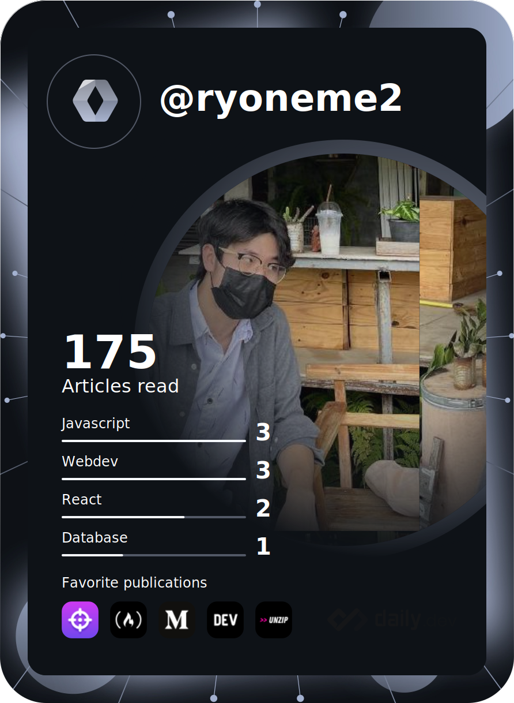

### Hi there 👋

- 🔭 I’m currently working as Freelance
- 🌱 I’m currently learning blockchain technology
- 📫 How to reach me: mail : worknarair6@gmail.com
- 🔹 You can reach My personal web site [Ryoneme2.github](https://Ryoneme2.github.io)
- 👨🏻‍💻 Currently. I studying at ChaingMai University

***

***

Web Development Full-Stack

Other Lang

CSS Framework for web-dev

Database

Design UX/UI

Etc..

Deployment

***

